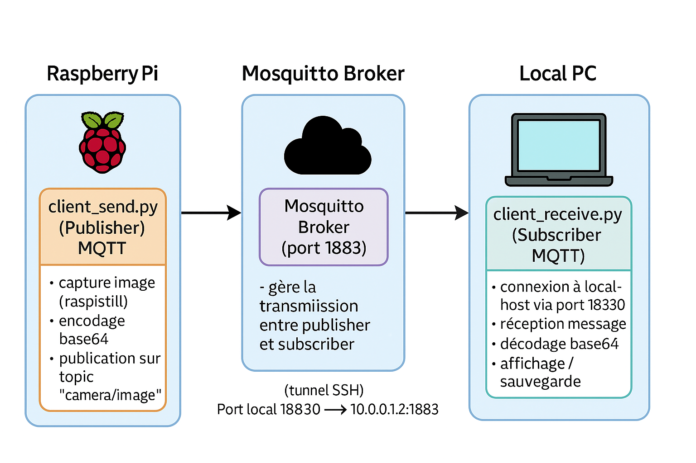

# 🌐 Sensor – Transmission d’images via MQTT

## 🎯 Objectif
Mettre en place une communication IoT entre un **Raspberry Pi** équipé d’une caméra et un **PC client**, en utilisant le protocole **MQTT**.  
Le Raspberry capture périodiquement une image, l’encode et la publie sur un *topic*.  
Le PC s’abonne à ce topic et affiche le flux d’images en direct.

---

## utilisation
```
ssh 10.0.1.13
```
lancer le script sendloopVersion1.sh, ça va exécuter le script /home/zhao/sendVersion1.py tous les 5 secondes  
```
./sendloopVersion1.sh  
```
Pour recevoir les images capturé, il faut lancer receiveVersion1.py  
```
python3 receiveVersion1.py
```


## 🧠 Théorie – Rappels MQTT
MQTT (*Message Queuing Telemetry Transport*) est un protocole léger basé sur le modèle **publish/subscribe** :

`[Publisher] → (Broker) → [Subscriber]`




- **Publisher** : envoie les messages (ici, les images capturées)
- **Subscriber** : s’abonne et reçoit les messages
- **Broker** : serveur central (ici, **Mosquitto** installé sur le Raspberry)

Avantages :
- Faible consommation réseau  
- Communication asynchrone et fiable  
- Idéal pour les systèmes distribués et les objets connectés  


---

## 🧩 Installation

### Raspberry Pi

Pour se connecter au Raspberry Pi, veuillez vous réferer à la documentation youpi.citi : https://youpi.citi.insa-lyon.fr/youpiDoc/youpi/registration/registration.html

Il faut réserver un appareil sur youpi.citi, dans cette exemple nous utilison le Raspberry 3B 10.0.1.2, puis pour se connecter au Raspberry en ssh :

```bash
ssh 10.0.1.2
```

Installations nécessaires (peut prendre beaucoup de temps): 

```bash
sudo apt update
sudo apt install mosquitto mosquitto-clients python3-opencv python3-pip -y
pip3 install paho-mqtt
sudo systemctl enable mosquitto
sudo systemctl start mosquitto
```

Ajouter les deux lignes suivantes dans `/etc/mosquitto/mosquitto.conf`: 
```bash
listener 1883
allow_anonymous true
```

Redémarrer mosquitto
```bash
sudo systemctl restart mosquitto
```

Il faut aussi autoriser l'utilisation de la caméra avec raspistill si ce n'est pas le cas: 

```bash
sudo raspi-config
```

Puis aller dans Interface Options → Legacy Camera → Enable. Une fois cela fait reboot le raspberry.

### PC local

Installations nécessaires :

```bash
sudo apt install python3-opencv python3-pip -y
pip3 install paho-mqtt
```

 Il faut également créer un tunnel entre ton PC et le Raspberry pour une connexion SSH:

```bash
ssh -fN -L 18830:10.0.1.2:1883 khamul
```

## ▶️ Utilisation

Lancer le tunnel SSH depuis le PC.

### Sur le PC :

```python
python3 client_receive.py
```

### Sur le Raspberry :

```python
python3 send_image.py --image image.jpg
```

Le flux d’images s’affiche en direct sur le PC à chaque nouvelle capture.
